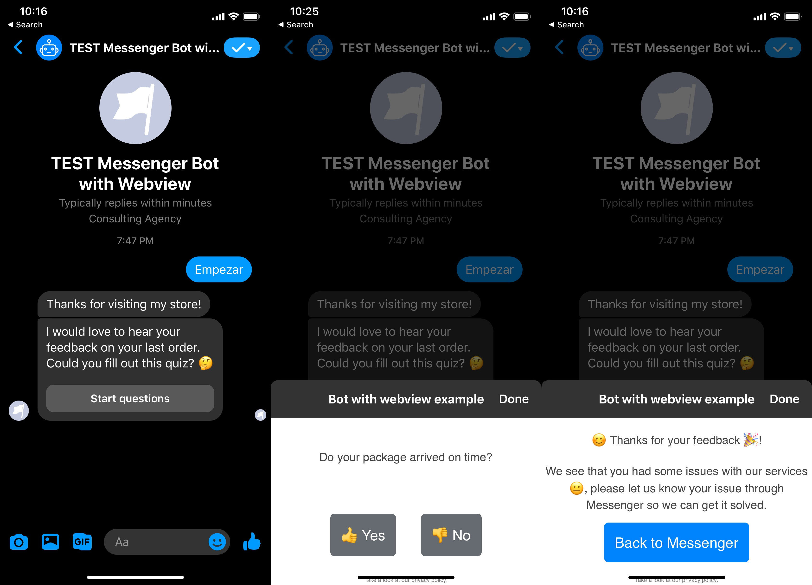

# Messenger bot with webview 
This is a really simple [Facebook Messenger](https://developers.facebook.com/docs/messenger-platform/) bot example that showcases the [webview](https://developers.facebook.com/docs/messenger-platform/webview/) functionality in Messenger by simulating a feedback quiz for an e-commerce company.

This example includes both a Messenger Experience based in the [getting started  guide from Faacebook](https://developers.facebook.com/docs/messenger-platform/getting-started/) and a super simple static website that's served from the `public` folder. It has some specific features needed to create a good webview experience inside Messenger. All of this is served with [Node](https://nodejs.org/en/) and deployed on a [Heroku](https://dashboard.heroku.com/) server.

The static site uses [Vue.js](https://vuejs.org/) to manage the states in the webview, but you could really use any other framework that can be served as a website.

## Installation
To run this repository on your local machine you first need to download the repository, install the necesary dependencies with `npm` and then run `node index.js` , if everything's ok you should be able to access the site at `locallhost:1337` and the endpoint for the webhook that can be used for Messenger is located at `localhost:1337/webhook``

## Test it out

You can check out this implementation of the Facebook Messenger Webview by starting a conversation in this m.me link: [m.me/messengerbotwithwebview](m.me/messengerbotwithwebview)